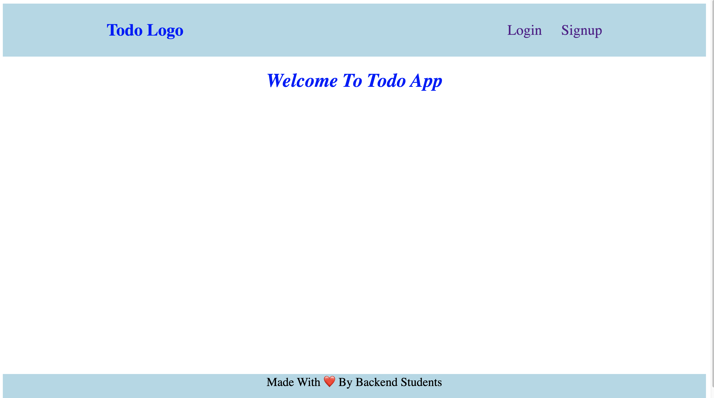
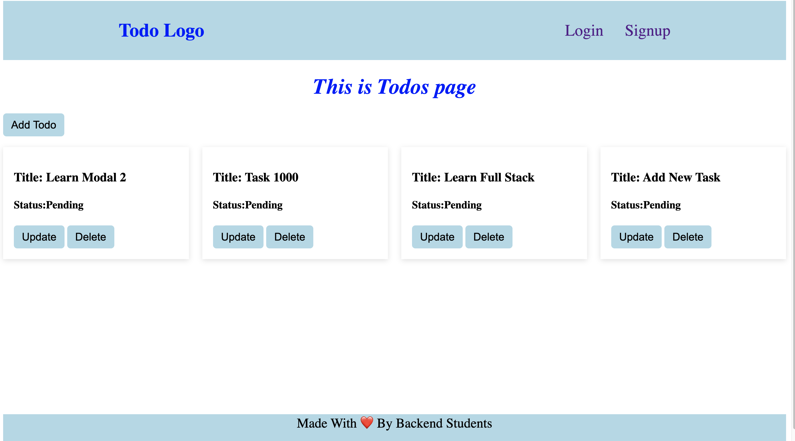

### Ideal Porject ReadMe Documentation Structure

# 📝 Project Name – *Personalised Todo App*

A frontend web application built using **HTML, CSS, and JavaScript**, featuring **real-time DOM manipulation** and **backend API integration** for persistent data management.

> *Example*: A Task Manager that lets users manage tasks with live updates synced to a backend server.

---

## 🚀 Live Demo

🌐 [Live App](https://your-live-demo-link.com)

---

## 📸 Images

Home Page

---
Todos Page

---
Add Todo

--- 
Update Todo


---

## 🎥 Video Walkthrough

📽 [Watch the walkthrough on YouTube](https://youtu.be/PvS9AmP9jfo?si=v8xyTpv0GrP_xiOr)


---

## 🛠 Features
* ✅ Signup/Login
* ✅ Authentocation, Authorization, Role Based Access Control
* ✅ Add, update, and delete tasks dynamically
* ✅ Mark tasks as completed
* ✅ Tasks are synced with a backend REST API (CRUD support)
* ✅ Responsive design with Flexbox/Grid
* ✅ Form validation and error handling
* ✅ Keyboard-accessible buttons & forms

---

## 📁 Project Structure

```
project-root/
├── assets/              # Screenshots, icons, etc.
├── components/          # Resuable components
├── styles/              # All Styling files
├── scripts/             # All Script files
├── index.html           # Main HTML structure
├── login.html           # Login Page
├── signup.html          # Login Page
├── todos.html           # Todos CRUD Page
├── README.md            # This file
└── LICENSE
```

---

## 🧠 Concepts Demonstrated

* DOM Manipulation: `querySelector`, `createElement`, `appendChild`, etc.
* Event Handling: `click`, `submit`, `change`
* Class and Style Toggling: `classList.add/remove/toggle`
* **Backend Integration** via `fetch` / `XMLHttpRequest`

  * REST API communication (GET, POST, PUT, DELETE)
  * JSON handling and promise chaining
  * Error handling with `.catch()`
* Async JavaScript: `fetch`, `async/await`
* Form and Input Handling
* Optional: Use of `localStorage` for fallback caching

---

## 🔌 Backend API

* The app integrates with a RESTful API.
* Example base URL: `https://api.example.com/tasks`
* Supported endpoints:

  * `GET /tasks`
  * `POST /tasks`
  * `PUT /tasks/:id`
  * `DELETE /tasks/:id`

> You can replace this section with actual Swagger/OpenAPI reference if available.

---

## 🧪 How to Run Locally

1. **Clone the repo:**

```bash
git clone https://github.com/your-username/project-name.git
```

2. **Navigate into the project:**

```bash
cd project-name
```

3. **Start a backend server** (if needed) or connect to an existing one

4. **Open `index.html` in your browser**

---

## 🧱 Tech Stack

* **Frontend:** HTML5, CSS3, JavaScript (ES6+)
* **Backend (External API):** Node.js / Express / any REST API
* **Tools:** Fetch API, Flexbox, Git

---

## 🌱 Future Improvements

* [ ] Authentication with JWT/session tokens
* [ ] Pagination and filtering
* [ ] Push notifications or WebSocket-based real-time updates
* [ ] Offline sync via Service Workers

---

## 📄 License

Licensed under [MIT License](./LICENSE)

---

## 👤 Author

**\[Your Name]**
🔗 [Portfolio](https://your-portfolio.com)
🐙 [GitHub](https://github.com/your-username)
🐦 [Twitter](https://twitter.com/your-handle)

---


